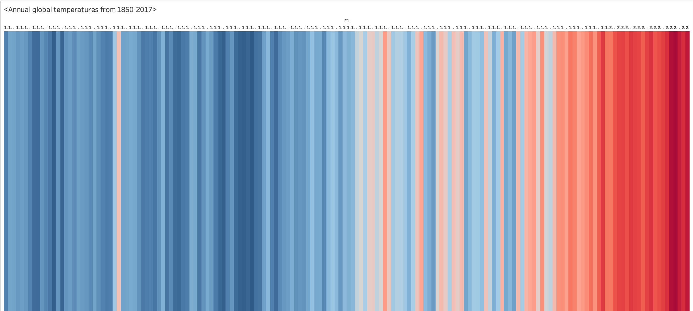

# Warming stripes

This is a replication of 

Ed Hawkins (2018): [Warming Stripes](http://www.climate-lab-book.ac.uk/2018/warming-stripes/). Climate Lab Book3; Data: (https://www.metoffice.gov.uk/hadobs/hadcrut4/data/current/download.html)

which features the following visualization:

